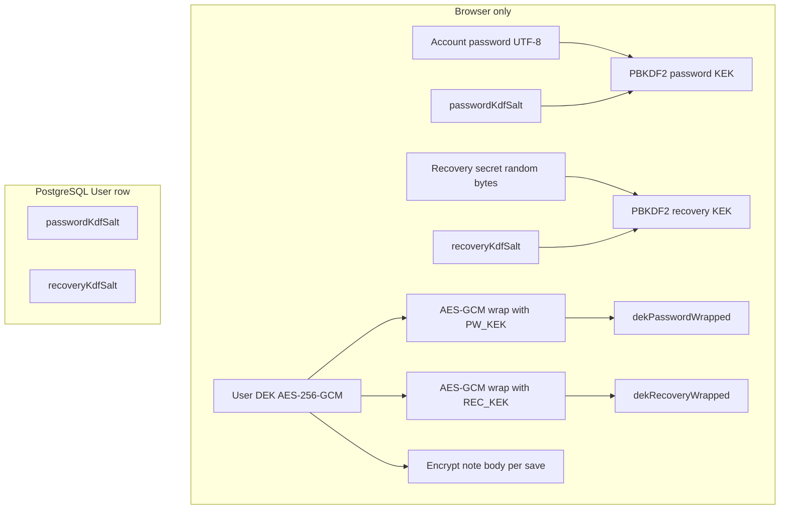

# Note encryption architecture

This document describes how Anchor implements **client-side** encryption for note bodies. It is aimed at engineers maintaining the web app and API.

---

## Goals and non-goals

**Goals**

- The server stores note `content` as **opaque ciphertext** when `isEncrypted` is true; it does **not** need (and never receives) the user’s plaintext DEK or account password.
- A single **per-user DEK** (data encryption key) encrypts all of that user’s encrypted notes.
- Unlocking encrypted notes requires the user’s **account password** during the browser session (or re-entering it via the vault banner).
- **Password reset via email OTP** remains possible without losing encrypted notes by using a **recovery secret**, stored offline by the user at registration.

**Non-goals / limitations**

- **Metadata is not E2EE**: titles, tags, pinning, archival, share lists, attachment records, and timestamps are visible to the server as normal application data.
- **Encrypted notes cannot be shared** with collaborators in the current product rules (plaintext sharing would contradict “server never sees plaintext”; key sharing is not implemented).
- **Attachments** are **disabled** while a note is encrypted (files are not enveloped under the DEK in this codebase).
- **Full-text search** over note bodies **skips** encrypted notes on the server; only plaintext notes match `content` search.
- **OIDC-only accounts** without password-registration vault fields do not have the client-generated vault described here; encrypted notes APIs require password-based vault (`dekPasswordWrapped` present).

---

## Cryptographic primitives

All browser cryptography uses the **Web Crypto API** (`globalThis.crypto.subtle`). Implementation lives primarily in [`web/features/encryption/crypto.ts`](../web/features/encryption/crypto.ts).

| Primitive | Algorithm / parameters | Role |
|-----------|-------------------------|------|
| KDF | **PBKDF2** · SHA-256 · **210,000 iterations** (`PBKDF2_ITERATIONS`) | Derive a 256-bit **KEK** (key-encryption key) from the password UTF-8 string or raw recovery secret bytes |
| Bulk / wrap | **AES-GCM** · 256-bit key · **12-byte random IV** per operation | Encrypt note UTF-8 plaintext; wrap (encrypt) exported DEK bytes |
| DEK | **AES-GCM** · 256-bit · `generateKey` | One symmetric key per user account (random) |

**Salts**

- `passwordKdfSalt` · `recoveryKdfSalt`: independent random salts (default length **16 bytes**, base64-encoded) used with PBKDF2 for password and recovery KEKs respectively.

**Wrapped DEK blob (JSON)**

`wrapDek` / `unwrapDek` use a compact JSON envelope:

```json
{ "v": 1, "iv": "<base64>", "ct": "<base64>" }
```

**Note ciphertext blob (JSON)**

`encryptNoteContentUtf8` / `decryptNoteContentUtf8` use:

```json
{ "v": 1, "k": "note", "iv": "<base64>", "ct": "<base64>" }
```

The server treats these strings as **opaque** `Note.content` text.

---

## Key hierarchy

At a high level:



- **DEK**: random; never leaves the browser unwrapped except as ciphertext on disk in the DB.
- **Password KEK**: PBKDF2(password, `passwordKdfSalt`) → unwraps `dekPasswordWrapped` after login or banner unlock.
- **Recovery KEK**: PBKDF2(recovery secret, `recoveryKdfSalt`) → unwraps `dekRecoveryWrapped` during password reset to recover the **same DEK**, then `dekPasswordWrapped` is replaced with a new wrap under the **new password** (same PBKDF2 salt unless password change rotates salt—see below).

---

## Browser requirements (`assertBrowserCryptoAvailable`)

[`assertBrowserCryptoAvailable()`](../web/features/encryption/crypto.ts) gates registration vault creation. It requires:

1. **`window.isSecureContext === true`** (HTTPS, or `localhost` / `127.0.0.1`).
2. `crypto.getRandomValues` and `crypto.subtle` present.

Plain `http://` to a LAN hostname or IP is typically **not** a secure context, so **SubtleCrypto is unavailable** and registration encryption cannot run. Deploy with HTTPS (or TLS reverse proxy) for real networks.

---

## Server-side persistence

Defined in [`server/prisma/schema.prisma`](../server/prisma/schema.prisma) on `User`:

| Field | Meaning |
|-------|---------|
| `dekPasswordWrapped` | AES-GCM ciphertext wrapping exported DEK; KEK from account password |
| `dekRecoveryWrapped` | AES-GCM ciphertext wrapping the **same** DEK; KEK from recovery secret |
| `passwordKdfSalt` | PBKDF2 salt for password KEK |
| `recoveryKdfSalt` | PBKDF2 salt for recovery KEK |

`Note.isEncrypted` is a boolean flag. `Note.content` holds either plaintext (legacy/normal) or the JSON ciphertext string.

The API includes an `encryption` object on session user payloads when **all four** fields are present (see [`buildEncryptionPayload`](../server/src/auth/utils/encryption-payload.util.ts)).

---

## Registration flow

1. User submits email, password, and profile fields on [`web/app/(auth)/register/page.tsx`](../web/app/(auth)/register/page.tsx).
2. **`createRegistrationVault(password)`** runs in the browser:
   - Generates `passwordKdfSalt`, `recoveryKdfSalt`, and `recoverySecretBase64` (32 random bytes, base64).
   - Generates **DEK**.
   - Derives password KEK and recovery KEK; produces `dekPasswordWrapped` and `dekRecoveryWrapped`.
3. Client downloads **`anchor-recovery-*.json`** containing `recoverySecret` and hints (offline backup).
4. Client sends **`RegisterDto`** with vault fields plus normal registration data; [`AuthService.validateRegistrationVault`](../server/src/auth/auth.service.ts) rejects missing/empty vault parts for password registration (see private `validateRegistrationVault`).
5. Server stores bcrypt password hash **and** the four opaque vault strings.
6. If the created user is **active**, login tokens are returned; [`use-auth`](../web/features/auth/hooks/use-auth.ts) calls `unlockVaultWithPassword` and **`storeDekFromCryptoKey`** so the DEK lands in session storage immediately.

Recovery file **never** goes to the server.

---

## Session DEK storage (vault session)

[`web/features/encryption/vault-session.ts`](../web/features/encryption/vault-session.ts):

- **Key**: `sessionStorage` key `anchor_dek_raw_b64`.
- **Value**: base64 of **raw 32-byte** AES key material (exported from `CryptoKey`).
- **Lifetime**: Until the tab/session ends or **`clearVaultSession()`** runs (logout calls this).

Design trade-off: storing raw key material in `sessionStorage` is convenient but **readable to script in the origin**—same XSS risk surface as typical SPA secrets. Prefer short-lived tabs and CSP hardening in production deployments.

Helpers: `getDekFromSession`, `storeDekFromCryptoKey`, `isVaultSessionUnlocked`.

---

## Login flow

[`use-auth`](../web/features/auth/hooks/use-auth.ts) `loginMutation`:

1. Calls login API; response includes user + **`encryption`** payload when vault exists.
2. `unlockVaultWithPassword(loginPassword, { dekPasswordWrapped, passwordKdfSalt })`.
3. `storeDekFromCryptoKey(dek)` → session unlocked for encrypted read/write.

If unwrap fails (wrong password cached client-side mismatch, corrupted data), a toast directs the user to the **vault unlock banner**.

---

## Vault unlock banner

[`web/features/auth/components/vault-unlock-banner.tsx`](../web/features/auth/components/vault-unlock-banner.tsx) shows when `user.encryption` exists and `!isVaultSessionUnlocked()`. User re-enters **account password** to unwrap and store DEK. Dispatches `anchor:vault-unlocked` for other UI to react if needed.

---

## Note editor behavior (web)

**Decrypt for display**

When loading a note with `isEncrypted`, editors use `getDekFromSession()`. If null, user sees an error toast and empty editor until unlock. If present, `decryptNoteContentUtf8(note.content, dek)` fills the rich text.

**Encrypt on save**

Before create/update mutations, if `isEncrypted`:

1. Resolve DEK via `getDekFromSession()`; abort with toast if missing.
2. Replace outgoing `content` with `encryptNoteContentUtf8(plaintext, dek)`.

This pattern appears in:

- [`web/app/(app)/notes/[id]/page.tsx`](../web/app/(app)/notes/[id]/page.tsx) (full-page editor)
- [`web/features/notes/components/new-note-modal.tsx`](../web/features/notes/components/new-note-modal.tsx)
- [`web/features/notes/components/edit-note-modal.tsx`](../web/features/notes/components/edit-note-modal.tsx)

**Attachments**

When `isEncrypted` is true, upload paths are gated (e.g. `canUpload` is false on the note page)—encrypted notes are **text-only** in this design.

**Toggling encryption**

UI may restrict enabling encryption if the user has no vault or if the note has shares (see server rules below).

---

## Server rules for encrypted notes

Implemented in [`server/src/notes/services/notes.service.ts`](../server/src/notes/services/notes.service.ts) and related services.

| Rule | Behavior |
|------|----------|
| Create encrypted note | `assertUserHasEncryptionVault(userId)` — user must have `dekPasswordWrapped`. |
| Enable encryption on existing note | Owner only; requires vault; **`assertNoteHasNoActiveShares`** — all shares must be removed first. |
| Edit encrypted note | **Owner only**. Editors with share access **cannot** update encrypted notes. |
| Share note | **`NoteSharesService`** rejects shares if `isEncrypted`. |
| Search | Listing search only applies `content contains` when `isEncrypted: false`; titles still searchable. |

Sync (`NotesService.sync`) mirrors many of these rules for offline-style updates (encrypt flag on upsert, owner-only encrypted edits).

---

## Change password (Settings)

[`web/app/(app)/settings/page.tsx`](../web/app/(app)/settings/page.tsx):

1. `unlockVaultWithPassword(currentPassword, enc)` → DEK.
2. **`wrapVaultForNewPassword(dek, newPassword)`** generates a **new** `passwordKdfSalt` and new `dekPasswordWrapped` (recommended when rotating password-derived KEKs).
3. API [`AuthService.changePassword`](../server/src/auth/auth.service.ts) updates bcrypt password and, when vault exists, **requires** the new wrap fields.

On success, client re-unlocks with **newPassword** and refreshes session DEK.

---

## Forgot password / reset (recovery file)

OTP and email flows are server-side in `AuthService` (`forgotPassword` → `verifyPasswordResetOtp` → JWT `password_reset` → `completePasswordReset`).

[`web/app/(auth)/forgot-password/page.tsx`](../web/app/(auth)/forgot-password/page.tsx):

1. After OTP verify, server returns **`resetToken`** plus **`dekRecoveryWrapped`** and **`recoveryKdfSalt`** (and existing **`passwordKdfSalt`** for re-wrap logic).
2. User pastes **recovery JSON**; client extracts `recoverySecret`.
3. `deriveKeyFromRecoverySecret` + `unwrapDek` → **same DEK** as before.
4. **`deriveKeyFromPassword(newPassword, passwordKdfSalt)`** (salt unchanged from account) + `wrapDek` → **`newDekPasswordWrapped`**.
5. `completePasswordReset` stores new bcrypt hash and **`dekPasswordWrapped`** only; recovery wrap and salts stay as they were.

Server **invalidates refresh tokens** on reset. Client then signs in with returned tokens and re-seeds session DEK.

---

## OIDC and accounts without a vault

Users who authenticate via OIDC without going through password registration may lack `dekPasswordWrapped` / full vault. They **cannot** use encrypted notes until a product flow adds vault provisioning (not covered here). `assertUserHasEncryptionVault` enforces this at the API.

---

## Security and operations checklist

- **HTTPS** in production so Web Crypto and registration work.
- **Recovery file** is single-user backup: loss = inability to reset password while keeping **old** encrypted notes readable (new account would have a new DEK).
- Server compromise reveals **ciphertext**, **vault wraps**, and **salts**, but not plaintext notes without guessing the password/recovery secrets or attacking PBKDF2/AES-GCM at practical cost.
- **Rotation**: changing password rotates **password-side** PBKDF2 salt (`wrapVaultForNewPassword`). Recovery-side salts and wraps stay fixed unless explicitly changed (they are not in the current reset path beyond unwrapping with recovery).

---

## File index

| Area | Location |
|------|----------|
| Crypto primitives | `web/features/encryption/crypto.ts` |
| Session DEK | `web/features/encryption/vault-session.ts` |
| Public exports | `web/features/encryption/index.ts` |
| Auth + unlock | `web/features/auth/hooks/use-auth.ts`, `vault-unlock-banner.tsx` |
| DB schema | `server/prisma/schema.prisma` |
| Register / login / reset / password | `server/src/auth/auth.service.ts` |
| Encryption DTO shaping | `server/src/auth/utils/encryption-payload.util.ts` |
| Note APIs | `server/src/notes/services/notes.service.ts`, `note-shares.service.ts` |
